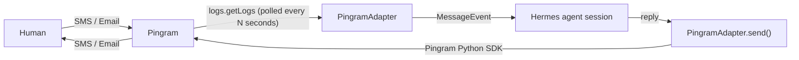

# Pingram Gateway for Hermes

Chat with your [Hermes](https://github.com/NousResearch/hermes) agent over **SMS**
and **Email**, routed through [Pingram](https://pingram.io). Text or email your
Pingram number/address and the agent replies on the same channel — including
inbound MMS images.

This is a self-contained Hermes **platform plugin**: one `plugin.yaml` + one
`adapter.py`. It registers a single `pingram` platform that serves both channels
(Pingram uses one API key for both). Inbound messages are received by **polling**
Pingram's logs API on a timer — there's **no public endpoint or webhook to set
up**. It requires **zero changes to Hermes core**.



The channel is encoded in the Hermes `chat_id` prefix: `sms:{phone}` and
`email:{thread}`.

## Requirements

- A running Hermes agent (`hermes gateway`).
- A Pingram account with an API key (`pingram_sk_...`). Sender identity is
  optional — Pingram provides a default SMS number and email sender, so you can
  start without provisioning your own.
- Python packages `pingram-python` (the Pingram SDK) and `aiohttp` available to
  the gateway — installed automatically into the Hermes venv on first run.
- No public host, tunnel, or webhook registration is required — the adapter
  polls Pingram for new messages.

## Install

```bash
hermes plugins install pingram-io/hermes-gateway
```

This git-clones the repo into `~/.hermes/plugins/pingram/` and the gateway
auto-discovers it on next start. The runtime dependencies (`pingram-python`, the
Pingram SDK imported as `pingram`, and `aiohttp`) are installed automatically
into the active Hermes venv the first time the plugin runs — there's no separate
`pip install` step.

## Configure

You can configure Pingram two ways — a guided wizard (recommended) or by
editing env vars directly.

### Option A: Guided setup (recommended)

First enable the plugin so it shows up in the gateway setup menu, then run the
wizard:

```bash
hermes plugins enable pingram
hermes setup gateway
```

Select **Pingram** from the messaging-platforms list and answer the prompts.
The wizard asks for your region and API key, then which channel(s) to enable
(SMS, Email, or both). Sender details are optional — for SMS you can use your
Pingram account's default number or pin a specific one; for Email you can set a
display name and address or leave them blank for Pingram's defaults. It also
asks how often to poll for new messages (default every 15s). It writes
everything to `~/.hermes/.env` for you — then just start the gateway.

### Option B: Manual env vars

Set these in your Hermes env (`~/.hermes/.env`) — see [`.env.example`](.env.example)
for the full list. At minimum you need the API key, region, and channel(s).

```bash
# Required:
PINGRAM_API_KEY=pingram_sk_...
PINGRAM_REGION=us                        # us | eu | ca — must match your Pingram account's region
PINGRAM_CHANNELS=sms,email               # which channels to enable: sms, email, or both

# Senders are OPTIONAL — leave them unset to use Pingram's account defaults.
#PINGRAM_FROM_SMS=+15551234567           # pin a specific verified Pingram number
#PINGRAM_FROM_EMAIL=agent@yourdomain.com # sender address on a verified domain
#PINGRAM_FROM_NAME=My Bot                # email sender display name

# Inbound polling cadence (optional):
#PINGRAM_POLL_INTERVAL=15                # seconds between polls (default 15)
#PINGRAM_POLL_LIMIT=50                   # max messages fetched per poll page

# Everything below is optional (defaults shown / commented out):
#PINGRAM_ALLOWED_USERS=+15559876543,you@yourdomain.com
#PINGRAM_ALLOW_ALL_USERS=false           # dev only
```

> Set `PINGRAM_REGION` to the region your Pingram account lives in (`us`, `eu`,
> or `ca`). It selects the API endpoint — the wrong value will fail to send.

Enable the platform in your gateway config (`~/.hermes/config.yaml`):

```yaml
plugins:
  enabled: true
gateway:
  platforms:
    pingram:
      enabled: true
```

Start (or restart) the gateway:

```bash
hermes gateway restart
```

## How inbound messages are received

The adapter polls Pingram's logs API (`logs.getLogs`) every
`PINGRAM_POLL_INTERVAL` seconds (default 15). Each cycle it fetches the newest
messages, keeps the ones that arrived since the last poll, and dispatches the
inbound SMS/Email to your agent. A startup watermark means only messages that
arrive **after** the gateway starts are delivered (history isn't replayed), and
per-message tracking-id deduplication guards against reprocessing.

This means there's nothing to expose to the internet — no public host, tunnel,
or webhook registration. Just start the gateway and text/email your Pingram
number/address.

Trade-offs versus a push webhook:

- **Latency**: delivery is delayed by up to one poll interval (lower the
  interval for snappier replies, at the cost of more API calls).
- **Email attachments**: inbound email **attachments are not downloaded** —
  Pingram's logs API returns attachment metadata only, not content. Inbound
  **SMS/MMS images are fetched** and passed to the agent for vision. Outbound
  file replies (the agent attaching files to an email) still work.

## SMS quickstart

1. Set `PINGRAM_API_KEY`, `PINGRAM_REGION`, and `PINGRAM_CHANNELS=sms`.
   Optionally pin `PINGRAM_FROM_SMS`; otherwise Pingram uses your default number.
2. Add your phone to `PINGRAM_ALLOWED_USERS`.
3. Start the gateway.
4. Text your Pingram number — the agent replies by SMS within a poll interval.
   Inbound MMS images are passed to the agent for vision.

## Email quickstart

1. Set `PINGRAM_API_KEY`, `PINGRAM_REGION`, and `PINGRAM_CHANNELS=email`.
   Optionally set `PINGRAM_FROM_EMAIL` / `PINGRAM_FROM_NAME`; otherwise Pingram
   uses its default sender.
2. Add your email to `PINGRAM_ALLOWED_USERS`.
3. Start the gateway.
4. Email your Pingram address — the agent replies in-thread (`Re:` subject)
   within a poll interval. The agent's file replies are sent back as email
   attachments. (Inbound email attachments are not downloaded when polling.)

## Security

The logs API is account-scoped and authenticated by `PINGRAM_API_KEY`, so there's
no inbound endpoint to authenticate. Defense-in-depth still applies to who the
agent will talk to:

- **User allowlist** — an inbound message's `from` must be in
  `PINGRAM_ALLOWED_USERS` unless `PINGRAM_ALLOW_ALL_USERS=true`. With no
  allowlist and `false`, inbound messages are ignored.
- **Deduplication** — each message is processed once (keyed on its Pingram
  tracking id), even if it appears across consecutive polls.
- Message bodies and secrets are never logged; phone numbers/emails are redacted.

## Configuration reference

| Env var | Required | Default | Description |
| --- | --- | --- | --- |
| `PINGRAM_API_KEY` | yes | — | Pingram API key (`pingram_sk_...`). |
| `PINGRAM_REGION` | yes | `us` | `us` \| `eu` \| `ca`. Must match your account's region — selects the API endpoint. |
| `PINGRAM_CHANNELS` | yes* | inferred | Channels to enable: `sms`, `email`, or `sms,email`. *Optional only if a sender is set (legacy inference). |
| `PINGRAM_FROM_SMS` | no | Pingram default | Pin a specific verified SMS sender number (E.164). Blank → account default. |
| `PINGRAM_FROM_EMAIL` | no | `noreply@pingram.io` | Email sender address (verified domain). Blank → Pingram default. |
| `PINGRAM_FROM_NAME` | no | Pingram default | Email sender display name (e.g. `My Bot`). |
| `PINGRAM_POLL_INTERVAL` | no | `15` | Seconds between polls for new inbound messages. |
| `PINGRAM_POLL_LIMIT` | no | `50` | Max messages fetched per poll page. |
| `PINGRAM_ALLOWED_USERS` | no | — | Allowed phones/emails (CSV). |
| `PINGRAM_ALLOW_ALL_USERS` | no | `false` | Allow everyone (dev only). |
| `PINGRAM_NOTIFICATION_TYPE` | no | `hermes_agent_reply` | Pingram notification `type`. |

## Known limitations (V1)

- **Inbound email attachments**: not downloaded. Polling Pingram's logs API
  returns attachment metadata only, not content. Inbound SMS/MMS images and
  outbound email file replies work fully.
- **Latency**: inbound delivery is delayed by up to one `PINGRAM_POLL_INTERVAL`.
- **Outbound SMS MMS**: the Pingram send API has no SMS media field, so the agent
  can't attach locally-generated images to an SMS. If a public image URL is
  available it's appended to the message text; otherwise a short note is added.

## License

MIT — see `LICENSE` if present, otherwise this plugin is provided under the MIT License.
