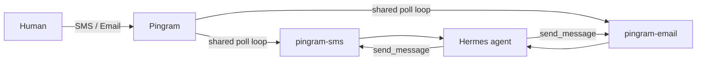

# Pingram Gateway for Hermes

Chat with your [Hermes](https://github.com/NousResearch/hermes) agent over **SMS**
and **Email**, routed through [Pingram](https://pingram.io). This plugin registers
three Hermes platforms:

| Platform | Purpose |
| --- | --- |
| `pingram-sms` | Text messaging (MMS images supported inbound) |
| `pingram-email` | Email threads with HTML replies |
| `pingram-voice` | Alpha stub — not available yet |

Inbound messages are received by **polling** Pingram's logs API — no public
endpoint or webhook is required.



## Install

```bash
hermes plugins install pingram-io/hermes-gateway
hermes plugins enable pingram
```

Runtime dependencies (`pingram-python`, `aiohttp`) auto-install on first gateway start.

## Configure

Run the gateway setup wizard — you'll see **three separate menu entries**:

```bash
hermes setup gateway
```

- **Pingram SMS** — region, API key, your phone number, optional sender override, welcome text
- **Pingram Email** — region, API key (reused if SMS already configured), your email, optional sender, welcome email
- **Pingram Voice (Alpha)** — info only: voice is coming soon; email hello@pingram.io for beta access

Each wizard enables its platform in `~/.hermes/config.yaml` and writes env vars to `~/.hermes/.env`.

### Manual env vars

See [`.env.example`](.env.example). Minimum for SMS:

```bash
PINGRAM_API_KEY=pingram_sk_...
PINGRAM_REGION=us
PINGRAM_SMS_ALLOWED_USERS=+15559876543
PINGRAM_SMS_HOME_CHANNEL=+15559876543
```

Minimum for Email:

```bash
PINGRAM_API_KEY=pingram_sk_...
PINGRAM_REGION=us
PINGRAM_EMAIL_ALLOWED_USERS=you@example.com
PINGRAM_EMAIL_HOME_CHANNEL=you@example.com
```

Enable platforms in `~/.hermes/config.yaml`:

```yaml
gateway:
  platforms:
    pingram-sms:
      enabled: true
    pingram-email:
      enabled: true
```

Then restart: `hermes gateway restart`

## Proactive sends

Each platform has its own home channel — no more choosing SMS vs email upfront:

- Text the user: `send_message` with `target="pingram-sms"`
- Email the user: `send_message` with `target="pingram-email"`

Explicit recipients also work: `pingram-sms:+15551234567`, `pingram-email:you@example.com`

## Chat ID formats

- **SMS**: bare E.164 — `+14167718196`
- **Email**: `user@example.com` or `user@example.com#thread-token` for threading

## Voice (alpha)

`pingram-voice` appears in setup but does not connect. Selecting it shows:

> Pingram Voice is in alpha and will be available ASAP. Email hello@pingram.io to reserve your spot for beta.

## Security

- Per-channel allowlists: `PINGRAM_SMS_ALLOWED_USERS`, `PINGRAM_EMAIL_ALLOWED_USERS`
- Optional dev override: `PINGRAM_ALLOW_ALL_USERS=true`
- Tracking-id deduplication prevents reprocessing across poll cycles
- PII redacted in logs

## Known limitations

- Inbound email attachments are not downloaded (polling mode)
- Outbound SMS cannot attach local files (link-only fallback)
- Inbound delivery delayed by up to `PINGRAM_POLL_INTERVAL` seconds (default 15)

## License

MIT
