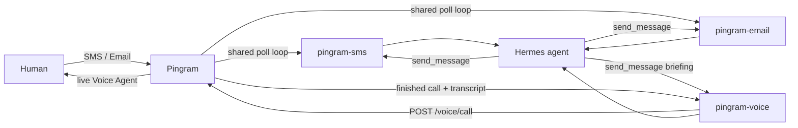

# Pingram Gateway for Hermes

Chat with your [Hermes](https://github.com/NousResearch/hermes) agent over **SMS**,
**Email**, and **Voice**, routed through [Pingram](https://pingram.io). This plugin
registers three Hermes platforms:

| Platform | Purpose |
| --- | --- |
| `pingram-sms` | Text messaging (MMS images supported inbound) |
| `pingram-email` | Email threads with HTML replies |
| `pingram-voice` | Outbound Pingram Voice Agent calls (live two-way AI) |

SMS and email inbound messages are received by **polling** Pingram's logs API — no
public endpoint or webhook is required. Voice is outbound: Hermes starts a Voice
Agent call with a briefing; Pingram hosts the live conversation on the phone.
When that call ends, the gateway polls the Voice calls API and injects the
outcome and transcript back into Hermes (only for calls Hermes placed).



## Install

```bash
hermes plugins install pingram-io/hermes-gateway
hermes plugins enable pingram
```

Runtime dependencies (`pingram-python`, `aiohttp`) auto-install on first gateway start.

## Configure

Run the gateway setup wizard — you'll see **three separate menu entries**:

```bash
hermes setup gateway
```

- **Pingram SMS** — region, API key, your phone number, optional sender override, welcome text
- **Pingram Email** — region, API key (reused if SMS already configured), your email, optional sender, welcome email
- **Pingram Voice** — create a Voice Agent in the Pingram app first, then the number to call

Each wizard enables its platform in `~/.hermes/config.yaml` and writes env vars to `~/.hermes/.env`.

### Manual env vars

See [`.env.example`](.env.example). Minimum for SMS:

```bash
PINGRAM_API_KEY=pingram_sk_...
PINGRAM_REGION=us
PINGRAM_SMS_ALLOWED_USERS=+15559876543
PINGRAM_SMS_HOME_CHANNEL=+15559876543
```

Minimum for Email:

```bash
PINGRAM_API_KEY=pingram_sk_...
PINGRAM_REGION=us
PINGRAM_EMAIL_ALLOWED_USERS=you@example.com
PINGRAM_EMAIL_HOME_CHANNEL=you@example.com
```

Minimum for Voice:

```bash
PINGRAM_API_KEY=pingram_sk_...
PINGRAM_REGION=us
PINGRAM_VOICE_ALLOWED_USERS=+15559876543
PINGRAM_VOICE_HOME_CHANNEL=+15559876543
# Voice Agent created in the Pingram app (blank = first agent on the account)
#PINGRAM_VOICE_AGENT_ID=agt_...
```

Enable platforms in `~/.hermes/config.yaml`:

```yaml
gateway:
  platforms:
    pingram-sms:
      enabled: true
    pingram-email:
      enabled: true
    pingram-voice:
      enabled: true
```

Then restart: `hermes gateway restart`

## Proactive sends

Each platform has its own home channel — no more choosing SMS vs email upfront:

- Text the user: `send_message` with `target="pingram-sms"`
- Email the user: `send_message` with `target="pingram-email"`
- Call the user: `send_message` with `target="pingram-voice"` (message is a briefing for the Voice Agent)

Explicit recipients also work: `pingram-sms:+15551234567`, `pingram-email:you@example.com`, `pingram-voice:+15551234567`

## Chat ID formats

- **SMS**: bare E.164 — `+14167718196`
- **Email**: `user@example.com` or `user@example.com#thread-token` for threading
- **Voice**: bare E.164 — `+14167718196`

## Voice

Create a Voice Agent in the Pingram app (model, voice, hang-up, tokens). Hermes
does not define those settings.

`pingram-voice` places an outbound call with that agent via `POST /voice/call`.
The `send_message` text is a briefing for this call (instructions + spoken
opener). After the call ends, Hermes gets a `[Pingram Voice call ended]`
message with outcome and transcript.

Someone calling a number bound to a Voice Agent in the Pingram app talks to
that agent directly — Hermes does not sit in the live audio path and does not
see inbound rings.

## Security

- Per-channel allowlists: `PINGRAM_SMS_ALLOWED_USERS`, `PINGRAM_EMAIL_ALLOWED_USERS`, `PINGRAM_VOICE_ALLOWED_USERS`
- Optional dev override: `PINGRAM_ALLOW_ALL_USERS=true`
- Tracking-id deduplication prevents reprocessing across poll cycles
- PII redacted in logs

## Known limitations

- Inbound email attachments are not downloaded (polling mode)
- Outbound SMS cannot attach local files (link-only fallback)
- Inbound delivery delayed by up to `PINGRAM_POLL_INTERVAL` seconds (default 15)
- Voice is outbound Voice Agent calls — Hermes is not in the live media path
- Voice transcripts arrive after hangup (poll interval), and only for calls Hermes placed

## License

MIT
