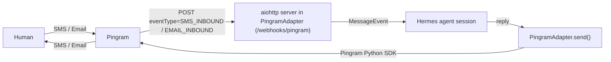

# Pingram Gateway for Hermes

Chat with your [Hermes](https://github.com/NousResearch/hermes) agent over **SMS**
and **Email**, routed through [Pingram](https://pingram.io). Text or email your
Pingram number/address and the agent replies on the same channel — including
inbound MMS images and email attachments.

This is a self-contained Hermes **platform plugin**: one `plugin.yaml` + one
`adapter.py`. It registers a single `pingram` platform that serves both channels
(Pingram uses one API key and one webhook URL for both). It requires **zero
changes to Hermes core**.



The channel is encoded in the Hermes `chat_id` prefix: `sms:{phone}` and
`email:{thread}`.

## Requirements

- A running Hermes agent (`hermes gateway`).
- A Pingram account with a verified SMS sender number and/or a verified email
  sending domain, plus an API key (`pingram_sk_...`).
- Python packages `pingram` and `aiohttp` available to the gateway.
- A way to expose the webhook port to Pingram (a public host, or `ngrok` for
  local development — see [`examples/`](examples/)).

## Install

```bash
hermes plugins install pingram-io/hermes-gateway
pip install pingram aiohttp
```

`hermes plugins install` git-clones this repo into `~/.hermes/plugins/pingram/`
and the gateway auto-discovers it on next start.

## Configure

Set these in your Hermes env (`~/.hermes/.env`) — see [`.env.example`](.env.example)
for the full list. At minimum you need the API key and one sender.

```bash
PINGRAM_API_KEY=pingram_sk_...
PINGRAM_REGION=us                       # us | eu | ca

# Configure at least one sender — each enables its channel:
PINGRAM_FROM_SMS=+15551234567           # verified Pingram/Telnyx number
PINGRAM_FROM_EMAIL=agent@yourdomain.com # verified sending domain

# Recommended: secure the webhook + restrict who can talk to the agent
PINGRAM_WEBHOOK_SECRET=pingram_whsecret_...
PINGRAM_ALLOWED_USERS=+15559876543,you@yourdomain.com
PINGRAM_ALLOW_ALL_USERS=false
```

Enable the platform in your gateway config (`~/.hermes/config.yaml`):

```yaml
plugins:
  enabled: true
gateway:
  platforms:
    pingram:
      enabled: true
```

Start (or restart) the gateway:

```bash
hermes gateway restart
```

The adapter starts an HTTP server on `PINGRAM_WEBHOOK_PORT` (default `8650`) with:

- `POST /webhooks/pingram` — Pingram delivers inbound SMS/Email here.
- `GET /health` — readiness/health check.

## Point Pingram at your webhook

In the **Pingram dashboard**, create a webhook whose URL is your public address
plus the webhook path, and subscribe it to the **`SMS_INBOUND`** and/or
**`EMAIL_INBOUND`** events:

```
https://<your-public-host>/webhooks/pingram
```

For local development, expose the port with ngrok (see
[`examples/docker-compose.yml`](examples/docker-compose.yml)) and use the
generated `https://<id>.ngrok-free.app/webhooks/pingram` URL.

When you create the webhook, Pingram gives you a signing secret
(`pingram_whsecret_...`). Put it in `PINGRAM_WEBHOOK_SECRET` to enable signature
verification (**secured mode**).

## SMS quickstart

1. Set `PINGRAM_API_KEY` and `PINGRAM_FROM_SMS`.
2. Add your phone to `PINGRAM_ALLOWED_USERS`.
3. Start the gateway and register the webhook URL for `SMS_INBOUND`.
4. Text your Pingram number — the agent replies by SMS. Inbound MMS images are
   passed to the agent for vision.

## Email quickstart

1. Set `PINGRAM_API_KEY` and `PINGRAM_FROM_EMAIL`.
2. Add your email to `PINGRAM_ALLOWED_USERS`.
3. Start the gateway and register the webhook URL for `EMAIL_INBOUND`.
4. Email your Pingram address — the agent replies in-thread (`Re:` subject).
   Inbound attachments are passed to the agent; the agent's file replies are
   sent back as email attachments.

## Security

Webhook signature verification is **optional and keyed on
`PINGRAM_WEBHOOK_SECRET`**:

- **Secured mode** (secret set): every webhook's `X-Pingram-Signature`
  (HMAC-SHA256 over `id.timestamp.body`) is verified via the Pingram SDK.
  Bad/missing signatures or stale timestamps are rejected with `401`.
- **Unsecured mode** (no secret): signatures are not checked; a one-time startup
  warning is logged.

Either way, defense-in-depth always applies:

- **Recipient validation** — inbound `to` must match your configured sender.
- **User allowlist** — `from` must be in `PINGRAM_ALLOWED_USERS` unless
  `PINGRAM_ALLOW_ALL_USERS=true`.
- **Deduplication** — repeated deliveries (by tracking id / message id / content
  hash) are dropped.
- Message bodies and secrets are never logged; phone numbers/emails are redacted.

## Configuration reference

| Env var | Required | Default | Description |
| --- | --- | --- | --- |
| `PINGRAM_API_KEY` | yes | — | Pingram API key (`pingram_sk_...`). |
| `PINGRAM_REGION` | no | `us` | `us` \| `eu` \| `ca`. |
| `PINGRAM_FROM_SMS` | one of | — | SMS sender number (E.164). Enables SMS. |
| `PINGRAM_FROM_EMAIL` | one of | — | Email sender address. Enables Email. |
| `PINGRAM_CHANNELS` | no | inferred | Channel filter, e.g. `sms,email`. |
| `PINGRAM_WEBHOOK_HOST` | no | `0.0.0.0` | Bind host. |
| `PINGRAM_WEBHOOK_PORT` | no | `8650` | Bind port. |
| `PINGRAM_WEBHOOK_PATH` | no | `/webhooks/pingram` | Webhook path. |
| `PINGRAM_WEBHOOK_SECRET` | no | — | Signing secret → secured mode. |
| `PINGRAM_WEBHOOK_TOLERANCE` | no | `300` | Signature timestamp tolerance (s). |
| `PINGRAM_ALLOWED_USERS` | no | — | Allowed phones/emails (CSV). |
| `PINGRAM_ALLOW_ALL_USERS` | no | `false` | Allow everyone (dev only). |
| `PINGRAM_NOTIFICATION_TYPE` | no | `hermes_agent_reply` | Pingram notification `type`. |

## Known limitations (V1)

- **Outbound SMS MMS**: the Pingram send API has no SMS media field, so the agent
  can't attach locally-generated images to an SMS. If a public image URL is
  available it's appended to the message text; otherwise a short note is added.
  Email attachments (in and out) and inbound MMS work fully.

## License

MIT — see `LICENSE` if present, otherwise this plugin is provided under the MIT License.
